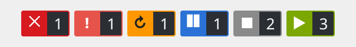
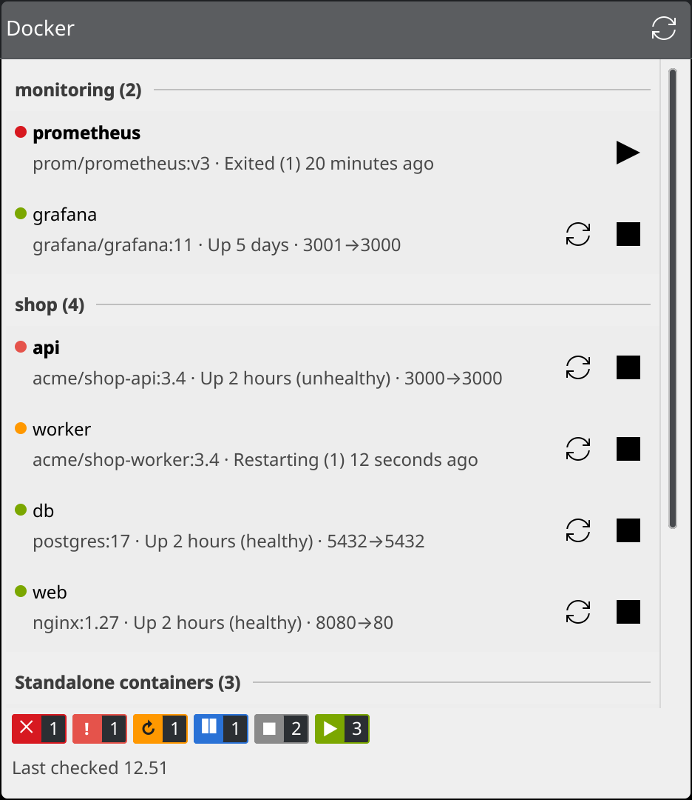

# Plasma Widgets

KDE Plasma 6 widgets for keeping an eye on GitHub, PRTG and Docker from the panel or desktop.

| Widget | Id | Shows |
|---|---|---|
| [GitHub Status](githubstatus) | `dk.madebypless.githubstatus` | GitHub's service health from githubstatus.com, with active incidents |
| [GitHub Account](githubaccount) | `dk.madebypless.githubaccount` | Count badges for review requests, notifications, open PRs and CI; click for the full lists. One widget per account. |
| [PRTG Status](prtgstatus) | `dk.madebypless.prtgstatus` | PRTG-style status badges (down, warning, unusual, paused, up…), with the problem sensors in a popup |
| [Docker Status](dockerstatus) | `dk.madebypless.dockerstatus` | Status badges for your containers (failed, unhealthy, restarting, paused, stopped, running), with start / stop / restart per container |

## Screenshots

The screenshots show sample data, apart from GitHub Status, which shows the live public feed.

### GitHub Status

In the panel, a coloured dot shows the overall status. Click it for the per-component view:


### GitHub Account

The panel shows count badges for review requests, unread notifications, open pull requests, and CI failing / running / passing. Badges with a zero count are hidden, and the badge style (square or rounded) and every colour can be changed under **Appearance** in the widget's settings. Click for the full lists:


### PRTG Status

The panel shows a badge per sensor state, like PRTG's own status bar. Under **Appearance** in the widget's settings you can switch to a rounded style like PRTG's newer interface and change every colour. In the General settings you can pick which states get a badge (in the panel and the popup), show states with no sensors, and add the total (e.g. "(of 919)"). Click for the problem sensors:


### Docker Status

The same badges for your Docker containers. Click for every container, grouped by Compose project, with start, stop and restart buttons:





A container counts as **failed** when it exited with an error. Exiting normally or being stopped with `docker stop` counts as **stopped**. The settings let you pick the Docker context (e.g. a Podman machine or remote host), how often to check (default every 15 seconds), which states get a badge, the badge style and colours, and whether to notify you when a container fails or becomes unhealthy.

## Install

Download the widget's `.plasmoid` file from the [latest release](https://github.com/pless84/plasma-widgets/releases/latest). Then right-click the panel or desktop → **Add Widgets** → **Get New** → **Install Widget From Local File…**, or run:

```sh
kpackagetool6 -t Plasma/Applet -i githubstatus.plasmoid
```

Or install from a clone:

```sh
git clone https://github.com/pless84/plasma-widgets.git
cd plasma-widgets
kpackagetool6 -t Plasma/Applet -i githubstatus   # repeat for each widget you want
```

Then right-click the panel or desktop → **Add Widgets** and search for the widget's name.

To update after pulling changes, use `-u` instead of `-i`. A widget already on the panel picks up changes after `plasmashell --replace &` or a new login.

## Requirements

- Plasma 6
- **GitHub Account:** the [GitHub CLI](https://cli.github.com/) (`gh`), logged in with `gh auth login`. The widget uses its stored login and never handles a token itself. It can show any account `gh` is logged in to, picked in its settings, so you can add one widget per account. Run `gh auth login` again to add more accounts.
- **PRTG Status:** `curl` and `secret-tool` (libsecret), and PRTG 22.2 or newer for API keys.
- **Docker Status:** the `docker` CLI with access to the daemon (e.g. your user in the `docker` group). Any `docker context` works, including Podman.

## PRTG setup

1. In PRTG, create a **read-only** API key: Setup → Account Settings → API Keys.
2. Open the widget's settings and enter the server address, e.g. `https://prtg.example.com`.
3. Paste the key into the **API key** field and click **Save to Keyring**. The page confirms when a key is stored for that server.

The key goes into your system keyring, never into the widget's settings file, and it's linked to the server address. Use `https`: over `http` the key is sent unencrypted, and the settings page warns you about that.

When the widget checks PRTG, the key is passed to `curl` on stdin, so it never shows up in the process list. Saving is the one exception: for a moment, while the key is being saved, it is part of a shell's command line.

You can also store the key from a terminal. The address must match the settings field exactly, without a trailing `/`:

```sh
wl-paste -n | secret-tool store --label="PRTG API key" service plasma-prtg server https://prtg.example.com
```

## Development

Preview a widget in its own window:

```sh
plasmawindowed dk.madebypless.githubstatus
```

`plasmoidviewer` from the `plasma-sdk` package is handy for testing panel and desktop layouts. QML errors from `plasmawindowed` go to the journal (`journalctl --user -f`).

## License

GPL-2.0-or-later. See [LICENSE](LICENSE).
