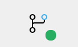
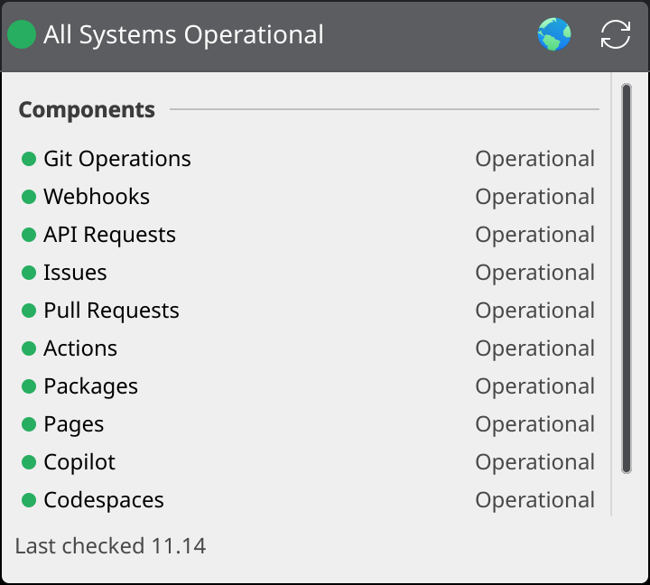
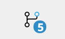
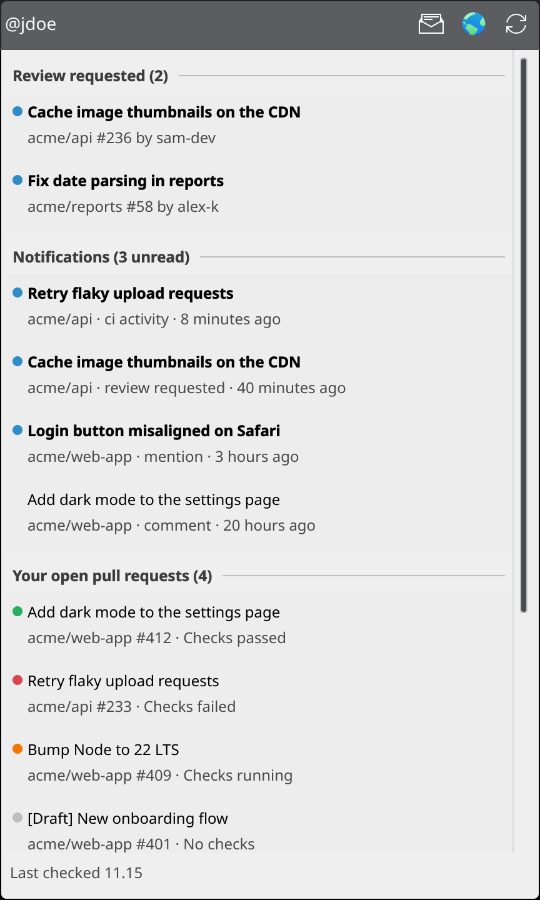
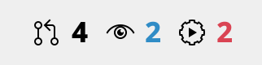
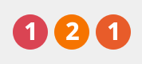
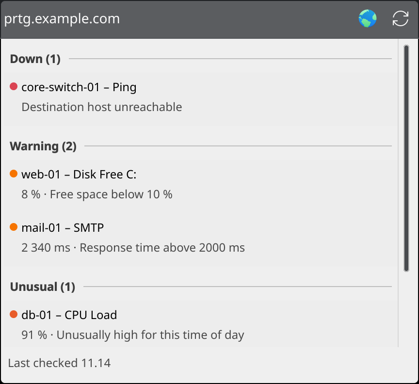

# Plasma Widgets

KDE Plasma 6 widgets for keeping an eye on GitHub and PRTG from the panel or desktop.

| Widget | Id | Shows |
|---|---|---|
| [GitHub Status](githubstatus) | `local.githubstatus` | GitHub's service health from githubstatus.com, with active incidents |
| [GitHub Account](githubaccount) | `local.githubaccount` | Your notifications, review requests, open PRs with CI state, and CI on recently pushed repos |
| [GitHub Counts](githubcounts) | `local.githubcounts` | Just three numbers in the panel: open PRs, review requests, failing CI |
| [PRTG Status](prtgstatus) | `local.prtgstatus` | Down / warning / unusual sensors from a PRTG Network Monitor server |

## Screenshots

The screenshots show sample data, apart from GitHub Status, which shows the live public feed.

### GitHub Status

In the panel, a coloured dot shows the overall status. Click it for the per-component view:





### GitHub Account

The badge counts unread notifications plus review requests:





### GitHub Counts

Open PRs, review requests, and failing CI, shown directly in the panel:



### PRTG Status

A pill appears in the panel for each problem category (down, warning, unusual):





## Install

```sh
git clone https://github.com/fbg-jap/plasma-widgets.git
cd plasma-widgets
kpackagetool6 -t Plasma/Applet -i githubstatus   # repeat for each widget you want
```

Then right-click the panel or desktop → **Add Widgets** and search for the widget's name.

To update after pulling changes, use `-u` instead of `-i`. A widget already on the panel picks up changes after `plasmashell --replace &` or a new login.

## Requirements

- Plasma 6
- **GitHub Account / GitHub Counts:** the [GitHub CLI](https://cli.github.com/) (`gh`), logged in with `gh auth login`. The widgets use its stored login and never handle a token themselves.
- **PRTG Status:** `curl` and `secret-tool` (libsecret), and PRTG 22.2 or newer for API keys.

## PRTG setup

1. In PRTG, create a **read-only** API key: Setup → Account Settings → API Keys.
2. Enter the server address (e.g. `https://prtg.example.com`) in the widget's settings.
3. Copy the key and store it in your keyring. The address must match the settings field exactly, without a trailing `/`:

   ```sh
   wl-paste -n | secret-tool store --label="PRTG API key" service plasma-prtg server https://prtg.example.com
   ```

   Or run the command without `wl-paste -n |` and paste the key at the `Password:` prompt. Don't put the key in `--label`.

The key is passed to `curl` on stdin, so it never shows up in the process list.

## Development

Preview a widget in its own window:

```sh
plasmawindowed local.githubstatus
```

`plasmoidviewer` from the `plasma-sdk` package is handy for testing panel and desktop layouts. QML errors from `plasmawindowed` go to the journal (`journalctl --user -f`).

## License

GPL-2.0-or-later. See [LICENSE](LICENSE).
